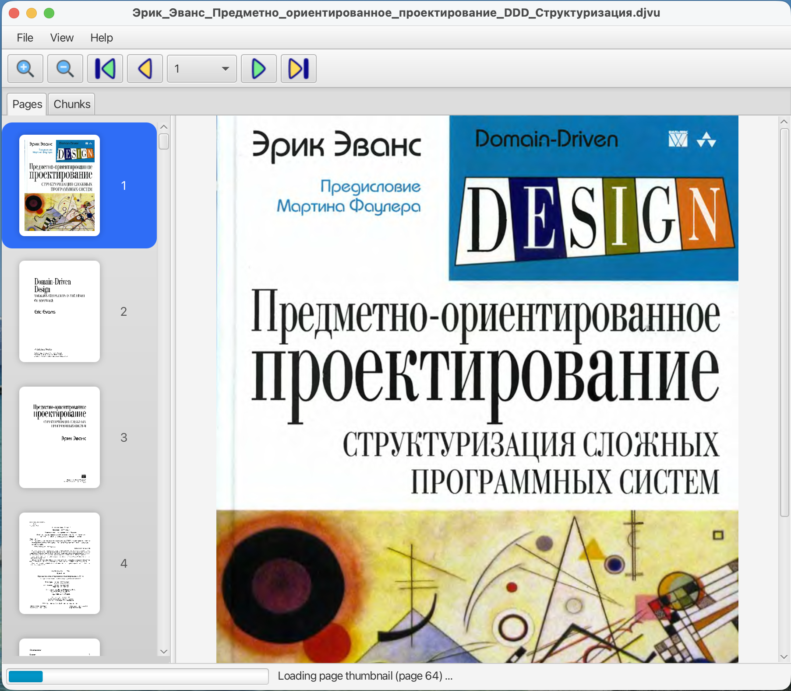

# DjVuReader

In scope of this project I want to learn DjVu file format and provide a simple tool for DjVu file viewing and may be an editting some metadata.




### Requirements
```
Java version 21
Maven version 3.9.11 
```

### Local build and run
```
$ mvn clean package
$ mvn exec:java
```

### Links
 - https://djvureader.atlassian.net/jira/software/projects/DJV/boards/1
 - https://github.com/DjvuNet/

Progressive image decoder for wavelet encoded images in compressed files and method of operation
https://patents.google.com/patent/US6587588B1/en


### Notes
  - To run TestFX tests on **macOS**, check the following system settings (see https://github.com/TestFX/TestFX/issues/641):
      * Go to System Settings > Security & Privacy > Accessibility
        * If you’re running tests from your **IDE**, enable your IDE in the list.
        * If you’re running tests from **Maven/Gradle** in the **Terminal** app, enable **Terminal**.

