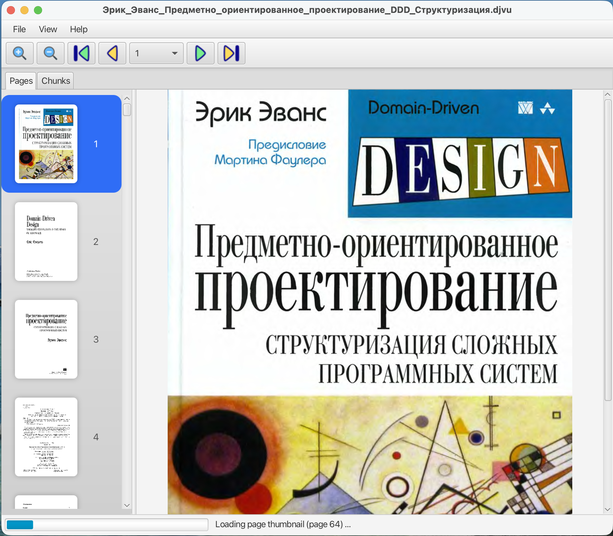
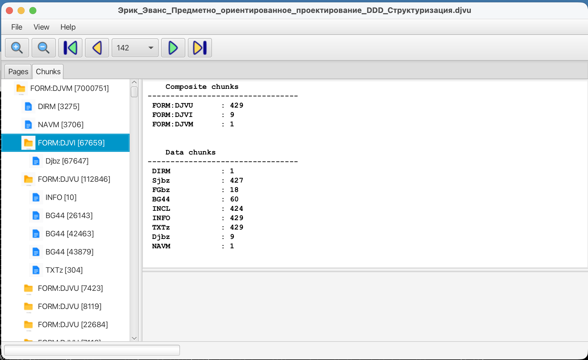

# DjVuViewer

This tool lets you view [DjVu](https://en.wikipedia.org/wiki/DjVu) files. 



### Implemented features

 The tool has two tabs on the left side: *Pages* and *Chunks*. The *Pages* tab is suitable for people 
 who are only interested in reading the document content. The *Chunks* tab is intended for those who 
 want to study the file structure.

#### Pages tab

 - Select a page thumbnail in the left-hand list to view it on the right. You can also select a page using the buttons on the toolbar.
 - When a navigation menu is present (*NAVM* chunk is optional), you can select a chapter from a dialog available via *View → Navigation*.
 - When an OCR layer is present (*TXTa*, *TXTz* chunks), you can select part of the text by pressing 
   the left mouse button, dragging, and then releasing the button.

#### Chunks tab

 - Select a chunk in the left-hand tree to view its details on the right.
 - Save non-composite chunk data to a separate file.
 - View chunk-frequency statistics: *View → Show Statistics*.



### Planned features

 - Edit **DjVu** file data
   - OCR text (**TXTa**, **TXTz** chunks)
   - Annotations (**ANTa**, **ANTz** chunks)
   - Clean up the document (remove undocumented/obsolete chunks such as **CIDa**, **LTAa**, **LTAz**)


### Requirements
```
Java version 21
Maven version 3.9.11 
```

### Local build and run
```
$ export MAVEN_OPTS="-Xmx2g"
$ mvn clean package
$ mvn exec:java
```

Please note that, by default, the tool is built for the *macOS (aarch64)* platform. 
If you need to build the tool for another platform, change the `javafx.platform` property in the **pom.xml** file.

### Native platform installer creation

#### Windows

You can create a Windows *.msi* installer by running the following command on a Windows platform:
```
$ mvn clean package -Pwin-installer
```
After the command completes successfully, you will find the *target/installer/DjVuViewer-1.0.0.msi* file. 
Please note that you need to have [WiX v3](https://github.com/wixtoolset/wix3/) installed.

You can find the logs here:
```
C:\Users\<user>\AppData\Local\DjVuViewer\Logs\app.log
```

#### MacOS

You can create a macOS *.dmg* installer by running one of the following commands on a macOS platform:
```
$ mvn clean package -Pmac-installer
```

or

```
$ mvn clean package -Pmac-aarch64-installer
```

You can find the logs here:
```
/Users/<user>/Library/Logs/DjVuViewer/app.log
```
If you need more detailed debug logs, run the application from the terminal:
```
$ /Applications/DjVuViewer.app/Contents/MacOS/DjVuViewer
```

The choice depends on the processor being used: Intel or Apple Silicon (aarch64). After the command completes successfully, 
you will find the target/installer/DjVuViewer-1.0.0.dmg file.

### Links
 - [This](https://djvureader.atlassian.net/jira/software/projects/DJV/boards/1) is a jira board of the project.
 - [This](https://github.com/DjvuNet/) is a C# library for working with the DjVu format.
 - [This patent](https://patents.google.com/patent/US6587588B1/en) describes an algorithm for decoding DjVu IW44 chunks.
 - [This](https://djvu.sourceforge.net/) is a C++ library for working with the DjVu format.


### Notes
  - To run TestFX tests on **macOS**, check the following system settings (see https://github.com/TestFX/TestFX/issues/641):
      * Go to System Settings > Security & Privacy > Accessibility
        * If you’re running tests from your **IDE**, enable your IDE in the list.
        * If you’re running tests from **Maven** in the **Terminal** app, enable **Terminal**.
